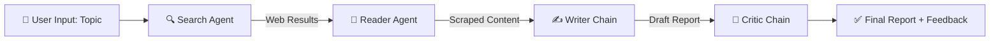

<div align="center">

# 🔬 ResearchMind

### *AI-Powered Multi-Agent Research Assistant*

[](https://www.python.org/)
[](https://www.langchain.com/)
[](https://streamlit.io/)
[](https://mistral.ai/)
[](https://tavily.com/)

**Four specialized AI agents collaborate — searching, scraping, writing, and critiquing — to deliver a polished research report on any topic.**

[🚀 Live Demo](https://multi-agent-research-system-main-fjsiqusz8tdplkwd6extyn.streamlit.app/) · [📖 Documentation](#-how-it-works) · [🐛 Report Bug](https://github.com/yourusername/researchmind/issues)

</div>

---

## ✨ Overview

> **ResearchMind** is a fully automated research pipeline powered by a team of AI agents. Give it a topic, and it will search the web, scrape the most relevant sources, write a structured report, and even **critique its own work** — all in one click.

<div align="center">

### 🌐 [**Try ResearchMind Live →**](https://multi-agent-research-system-main-fjsiqusz8tdplkwd6extyn.streamlit.app/)

</div>

```
🔍 Search  →  📄 Scrape  →  ✍️ Write  →  🧐 Critique  →  ✅ Final Report
```

---

## 🎯 Features

| Feature | Description |
|---|---|
| 🔍 **Search Agent** | Uses Tavily API to find recent, reliable info on any topic |
| 📄 **Reader Agent** | Scrapes and extracts deep content from the most relevant URL |
| ✍️ **Writer Chain** | Drafts a structured, professional research report |
| 🧐 **Critic Chain** | Self-reviews the report and gives a score out of 10 |
| 🎨 **Custom Dark UI** | Sleek, glassmorphism-inspired Streamlit interface |
| 📊 **Live Pipeline Tracker** | Real-time status of each agent as it works |
| ⬇️ **Export Reports** | Download generated reports as Markdown files |

---

## 🏗️ Architecture



---

## 🛠️ Tech Stack

<div align="center">

| Layer | Technology |
|---|---|
| 🧠 **LLM** | Mistral AI (`mistral-small-latest`) |
| 🔗 **Framework** | LangChain (Agents + Chains) |
| 🌐 **Search** | Tavily Search API |
| 🕸️ **Scraping** | BeautifulSoup4 |
| 🎨 **Frontend** | Streamlit + Custom CSS |
| 🔐 **Config** | python-dotenv |

</div>

---

## ⚙️ How It Works

### 1️⃣ Search Agent 🔍
Searches the web for recent, reliable information using the **Tavily API** and returns titles, URLs, and snippets.

### 2️⃣ Reader Agent 📄
Picks the most relevant URL from the search results and **scrapes the full content** for deeper context.

### 3️⃣ Writer Chain ✍️
Combines the search results and scraped content to write a **structured report** with:
- Introduction
- Key Findings (3+ points)
- Conclusion
- Sources

### 4️⃣ Critic Chain 🧐
Reviews the generated report and provides:
- A score out of 10
- Strengths
- Areas to improve
- A final verdict

---

## 🚀 Getting Started

### Prerequisites
```bash
Python 3.10+
Mistral AI API Key
Tavily API Key
```

### Installation

```bash
# 1️⃣ Clone the repository
git clone https://github.com/yourusername/researchmind.git
cd researchmind

# 2️⃣ Create virtual environment
python -m venv venv
venv\Scripts\activate      # Windows
source venv/bin/activate   # Mac/Linux

# 3️⃣ Install dependencies
pip install -r requirements.txt
```

### Setup Environment Variables

Create a `.env` file in the root directory:

```env
MISTRAL_API_KEY=your_mistral_api_key_here
TAVILY_API_KEY=your_tavily_api_key_here
```

### Run the App

```bash
streamlit run app.py
```

---

## 📁 Project Structure

```
ResearchMind/
│
├── 📄 app.py            # Streamlit UI
├── 🤖 agents.py          # Agent + Chain definitions
├── 🔧 tools.py           # Search & scrape tools
├── ⚙️ pipeline.py         # CLI pipeline runner
├── 📋 requirements.txt   # Dependencies
├── 🔐 .env               # API keys (not committed)
└── 📖 README.md          # You are here!
```

---

## 🖥️ CLI Usage (Without UI)

```bash
python pipeline.py
```

```
Enter a research topic: Quantum Computing in 2025

==================================================
Step 1 - Search Agent is working...
==================================================
==================================================
Step 2 - Reader Agent is scraping top resources...
==================================================
==================================================
Step 3 - Writer is drafting the report...
==================================================
==================================================
Step 4 - Critic is reviewing the report...
==================================================
```

---

## 🎨 UI Preview

<div align="center">

| 🌑 Dark Theme | 🟠 Live Pipeline | 📝 Report + Critique |
|:---:|:---:|:---:|
| Sleek glassmorphism design | Real-time agent status | Self-reviewed reports |

</div>

---

## 🌟 What Makes This Unique?

```diff
+ Multi-agent collaboration (not just a single chatbot!)
+ Self-critique loop — the AI reviews its own output
+ Real-time pipeline visualization
+ Professional, custom-built dark UI
+ Downloadable, shareable research reports
```

---

## 🔮 Future Improvements

- [ ] Add LangGraph for stateful, conditional workflows
- [ ] Multi-source scraping (not just one URL)
- [ ] PDF export support
- [ ] Chat-based follow-up questions on reports
- [ ] Support for multiple LLM providers

---

## 🤝 Contributing

Contributions, issues, and feature requests are welcome!

```bash
1. Fork the repo
2. Create your feature branch (git checkout -b feature/amazing-feature)
3. Commit your changes (git commit -m 'Add amazing feature')
4. Push to the branch (git push origin feature/amazing-feature)
5. Open a Pull Request
```

---

## 📜 License

This project is licensed under the **MIT License**.

---

<div align="center">

### 💡 Built with curiosity, agents, and a lot of debugging.

⭐ **If you found this useful, give it a star!** ⭐

**Made with ❤️ using LangChain + Mistral AI + Streamlit**

</div>
